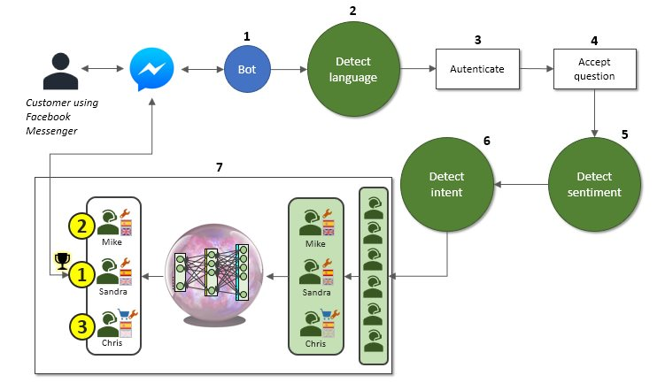

# AIRoutingBot

Example of an AI-powered routing bot capable of detecting the language, 
sentiment and intent of a customer question (using Machine Learning cloud services) and select the best agent according 
to customer profile, history and agent info (using a deep learning model).

Detailed in the following articles:
1. [Building an AI-powered routing chatbot - part 1/4: Creating a Facebook Messenger bot using Python and the Facebook API](http://www.ricardoencarnacaosantos.com/howto/ai_routing_bot/Building_an_AI_powered_routing_chatbot_PART_1.htm)

2. [Building an AI-powered routing chatbot - part 2/4: Identifying the customer, the language and the sentiment using Microsoft Text Analytics services](http://www.ricardoencarnacaosantos.com/howto/ai_routing_bot/Building_an_AI_powered_routing_chatbot_PART_2.htm)

3. [Building an AI-powered routing chatbot - part 3/4: Identifying the intent of the customer using Microsoft LUIS](http://www.ricardoencarnacaosantos.com/howto/ai_routing_bot/Building_an_AI_powered_routing_chatbot_PART_3.htm)

4. [Building an AI-powered routing chatbot - part 4/4: Choosing the best human agent with a neural network built using Keras and Tensorflow](http://www.ricardoencarnacaosantos.com/howto/ai_routing_bot/Building_an_AI_powered_routing_chatbot_PART_4.htm)

## Programming language

* Python (3.6.5)

## Requirements

* flask 
* keras 
* tensorflow 
* h5py 
* numpy 
* requests

By Ricardo Santos, 2018
